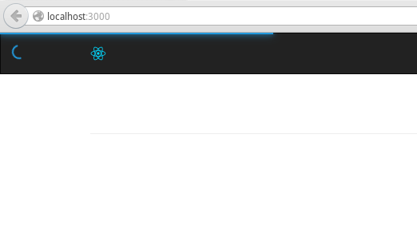

# React Progress Bar Plus

Progress bar component for ReactJS.

[](http://vn38minhtran.github.io/react-progress-bar-plus)

## Installation

### NPM
```bash
npm install --save react-progress-bar-plus
```

### Bower
```bash
bower install --save react-progress-bar-plus
```

## Usage

### JS

```js
var ProgressBar = require('react-progress-bar-plus');

<ProgressBar percent={10}/>
```

### CSS

**Webpack:**

```js
require('react-progress-bar-plus/lib/progress-bar.css');
```

**Without Webpack:**

```html
<link rel="stylesheet" type="text/css" href="path/to/react-progress-bar-plus/lib/progress-bar.css">
```

### UMD

```html
<link rel="stylesheet" type="text/css" href="path/to/react-progress-bar-plus/dist/progress-bar.css">
<script src="path/to/react-progress-bar-plus/dist/react-progress-bar-plus.js"></script>
```

```js
...
var ProgressBar = window.ReactProgressBarPlus;
...
```

Example [here](http://codepen.io/vn38minhtran/pen/QjaZrm)

## Props
| Name | Type | Default | Description |
|------|------|---------|-------------|
| percent | number | -1 | Progress percent |
| onTop | bool | false | Progress bar will ontop & height 100% |
| autoIncrement | bool | false | if `true` percent will auto increment `Math.random() + 1 - Math.random()`% in `intervalTime` ms. |
| intervalTime | number | 200 | Interval time for auto increment. |
| spinner | oneOf([false, 'left', 'right'])   | left | Spinner position. Pass `false` to hide spinner icon. |
| className | string |  | Custom class |

## Example

View [demo](http://vn38minhtran.github.io/react-progress-bar-plus) or example folder.

## License

MIT Licensed. Copyright (c) Minh Tran 2016.
